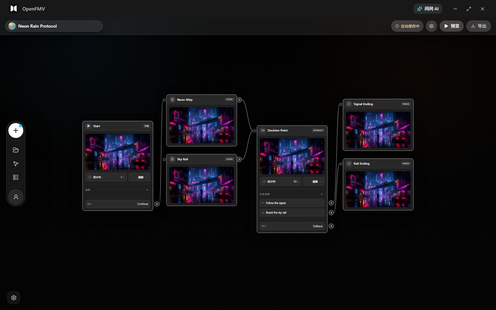
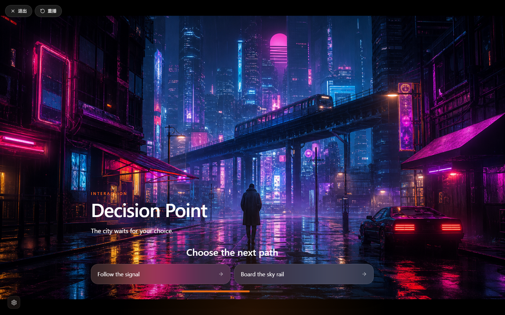
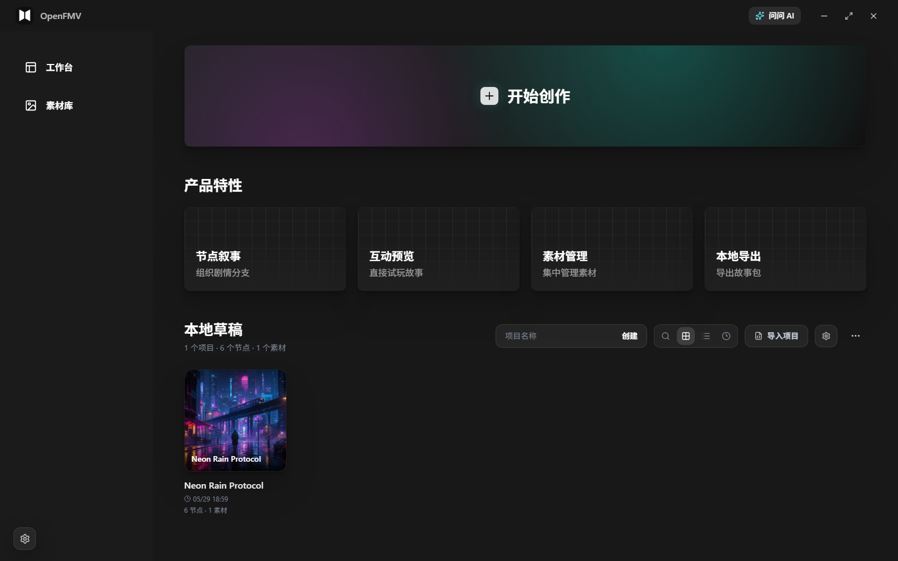

# OpenFMV

<p align="center">
  
</p>

<p align="center">
  English · <a href="./README.zh-CN.md">简体中文</a> · <a href="./README.ja.md">日本語</a> · <a href="./README.ko.md">한국어</a>
</p>

OpenFMV is a local-first visual nonlinear storytelling editor for building interactive videos, branching narratives, interactive short dramas, and standalone desktop story experiences.

The current project is a Next.js 14 + Electron desktop app. It uses React Flow to build the story graph editing canvas. Project files, imported assets, and exported content are stored locally, with no account system, database, or cloud storage dependency.



## Features

- Visual story graph: organize nonlinear narratives with start, story, interaction, and ending nodes.
- Branching interactions: support choices, text input, slide-to-unlock, countdowns, and default paths.
- Local asset management: import images, videos, audio, and text assets, then keep them with the local project.
- Instant playback preview: open the player view after editing to verify the branching experience.
- Project import and export: save projects as OpenFMV JSON files for backup, migration, and version control.
- Desktop game export: package a project into a runnable Electron desktop experience.
- Local AI assistance: the desktop app can call local CLI agents or model services configured with your own keys.

## Screenshots

### Branching Playback Preview



### Local Project Workspace



## Tech Stack

- Next.js 14 App Router
- TypeScript
- React 18
- React Flow
- Zustand
- Tailwind CSS
- Electron
- Vitest

## Quickstart

### Requirements

- Node.js 20 or later
- npm
- Windows is the primary supported desktop environment; web development mode can run on other systems.

### Install Dependencies

```bash
npm install
```

### Start the Web Development Server

```bash
npm run dev
```

Default URL:

```text
http://localhost:3000
```

### Start the Desktop App

```bash
npm run desktop:dev
```

To run the built standalone version:

```bash
npm run build
npm run desktop:standalone
```

## Common Commands

```bash
npm run dev                 # Start the Next.js development server
npm run desktop             # Start the Electron desktop app
npm run desktop:dev         # Start desktop development mode
npm run desktop:standalone  # Start standalone desktop mode
npm run build               # Build the app
npm run package:desktop     # Package the desktop app
npm run lint                # Run lint
npm run test:run            # Run tests
```

Run a single test file:

```bash
npx vitest path/to/test.test.ts
```

Run a single named test:

```bash
npx vitest path/to/test.test.ts -t "test name"
```

## Project Structure

```text
app/
  _components/          React components
    nodes/              React Flow node components
    editor/             Editor UI
    player/             Player components
    local/              Local desktop UI
    ui/                 Shared UI components
  _hooks/               React hooks
  _store/               Zustand stores
  _types/               Shared TypeScript types
  _utils/               Utility functions
  api/                  Local Next.js API routes
  editor/               Editor page
  play/[id]/            Player page
  projects/             Project management page
  asset-studio/         Asset studio
  assets/               Assets page
electron/
  main.js               Electron main process and IPC
  preload.js            Preload API
  exporter.js           Desktop experience exporter
scripts/                Build and packaging scripts
__tests__/              Tests
```

## Project Files

OpenFMV projects are saved as JSON. Core fields include:

```text
schemaVersion
id
title
graphData
assets
metadata
createdAt
updatedAt
```

Imported assets are copied into the local project or app data directory. When exporting a project or desktop experience, related assets are copied into the output directory so the result can run without relying on the original asset paths.

## Desktop Export

Use:

```bash
npm run package:desktop
```

After the build completes, the desktop app is output to `dist/`. Interactive stories exported from the app include the runtime, project graph data, and asset resources, making them suitable for distribution to players or testers.

## Development Notes

- The project follows a local-first design and does not include login, user sync, hosted backends, databases, or cloud storage.
- Shared type definitions live in `app/_types/index.ts`.
- When adding a new node type, update the types, node registration, editor component, player logic, and export runtime together.
- Styling uses Tailwind CSS, with custom colors centralized in `app/globals.css`.
- React Flow node components should be wrapped with `React.memo`.

For more architecture rules, see `docs/architecture-boundaries.md` and `docs/editor-connection-rules.md`.

## Contributing

Issues and pull requests are welcome. Before submitting, run:

```bash
npm run lint
npm run test:run
```

If your change affects desktop export or playback flow, also manually verify editing, saving, previewing, and export paths.

## License

This project is open source under the MIT License. You may freely use, copy, modify, merge, publish, distribute, sublicense, and sell copies of this project, including for commercial use, provided that the original copyright notice and license text are retained in all copies or substantial portions.
